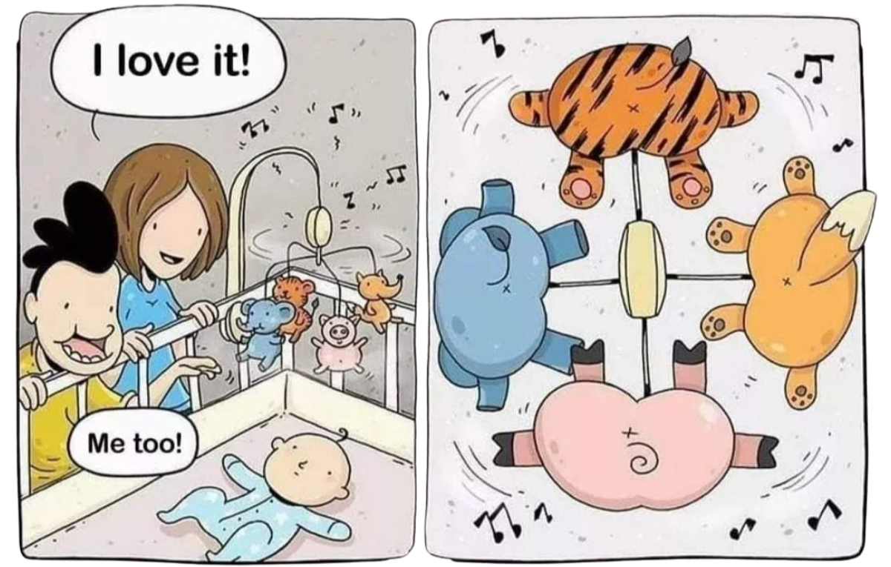

<h1 align="center">Hi, I'm Tomi! 👋</h1>

Product &amp; Program Manager with 7+ years shipping institutional-grade products across blockchain and fintech. 
Currently Product Manager at <a href="https://moonsonglabs.com">Moonsong Labs</a>, leading delivery and client success across blockchain and dev tooling engagements.

Track record of building and leading cross-functional Product, Engineering, and Design teams. 
My main skill is mixing <b>product &amp; business mindset with technical knowledge</b> to ship blockchain solutions.

You will often find me advocating to <b>keep the user (or the client) at the center of the process</b>.

  

  
  

